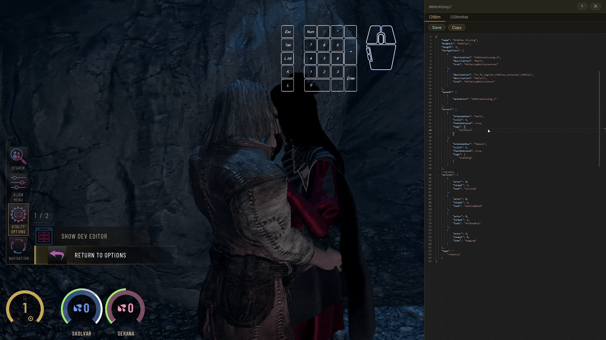

# OStim Navigator

A powerful SKSE plugin for **Skyrim** that provides an advanced in-game interface for browsing, filtering, and navigating **OStim** scenes in real-time.

> For more details on the underlying GUI framework, see the [SKSE Menu Framework README](./SKSE%20Menu%20Framework%20README.md).

---

## Requirements

| Mod | Required | Notes |
|---|---|---|
| [OStim](https://www.nexusmods.com/skyrimspecialedition/mods/98163) | ✅ Required | Version **v7.4c** or higher |
| [Prism UI](https://www.nexusmods.com/skyrimspecialedition/mods/148718) | ✅ Required | Powers the new in-game scene editor |
| [OStimNet](https://github.com/tetherball88/OStimNet/releases/latest) | ✅ Required | Used for generating scene descriptions |
| [SKSE Menu Framework](https://www.nexusmods.com/skyrimspecialedition/mods/120352) | ⚠️ Optional | Powers the thread manager UI via SKSE Menu Framework. **Deprecated** — still functional but will not receive future updates |

---

## New Prisma UI GUI for Modders


This is an in-game **OStim scene editor** built for modders. It supports OStim's upcoming **hot reload** functionality (not yet officially released by OStim), which will let you edit and save scenes while in-game and have OStim respect those changes immediately.

> ⚠️ **Note:** Not everything works perfectly with hot reload yet. For example, `sosBend` currently ignored after a hot reload.

> ⚠️ **This feature is intended for modders only — not regular end users!**

Hot reload does work, but it isn't fully reliable during long play sessions. If something goes wrong, it's best to reload your game rather than continue troubleshooting mid-session.

### Opening the Editor & Controls

You can open the editor through OStim's own options menu:

> Navigate with your OStim hotkeys to `Options` → `OStim Navigator Options` → `Show Dev Editor`.

This opens a **Prisma UI** modal window, which will automatically gain focus and show the cursor so you can interact with the OStim Navigator table.

**New to Prisma UI?** Here's what you need to know:
- While the Prisma UI cursor is **visible**, you cannot rotate the camera in-game — this is the **focused** state.
- When the cursor is hidden, that's the **unfocused** state, and normal camera controls return.

The editor is designed primarily for **mouse** use.

**Key hotkey:** `Num2` (default) — toggles between `focused` and `unfocused` states.

Even while OStim Navigator is in the `focused` state, you can still use your regular OStim hotkeys to navigate scenes normally.


### Filters and Table

The editor includes multiple filters to help you quickly narrow down and locate the exact scene you want to edit.

- The **table** lists animations, each with a `Warp` button that instantly jumps you to that scene.
- The **top row** always represents your currently active animation.
- The `Edit` button opens the **Scene JSON Editor**:
  - If you click `Edit` on the **currently active** animation, the editor content will automatically update as you navigate through scenes using your normal OStim hotkeys.
  - If you click `Edit` on **any other** scene in the table, the editor locks to that specific scene and will **not** change even if you navigate away via OStim hotkeys.

### OStim Scene JSON Editor

This is a VS Code-style JSON editor built right into the game. It supports familiar editor hotkeys — for example, `CTRL+S` saves your changes directly to the scene file on your file system.

> ⚠️ **Always back up your files before editing.** Using Git (or another version control tool) is strongly recommended so you can easily revert to a previous stable version if something breaks.

> **MO2 users:** Saved changes are written to the corresponding file inside your mod folder.

Editor features:

- **Schema validation** — checks your JSON for typos in key names and ensures all minimum required fields are present.
- **Intellisense for `tags` and `actions` strings** — start typing a quotation mark (`"`) inside those fields to get a dropdown of the most commonly used tags and action strings (sourced directly from OStim-NG's files).
- **`Add action` button** — click this next to the `"actions"` key to insert an empty template automatically:

```json
{
    "actor": 0,
    "type": ""
}
```



---

## OStimNet Tab

When you open the editor, you'll notice a second tab called **OStimNet**. This tab belongs to my other mod, **OStimNet**, but it contains two dropdowns that help improve automatic animation classification and filtering:

### Intent Dropdown

This sets the scene's **intent** — but keep in mind, **most scenes don't need an intent at all.** Only apply one if your animation clearly and specifically depicts one of the following situations:

| Intent | Description |
|---|---|
| *(none)* | Generic scene that can be used with any thread intent. |
| `platonic` | Non-romantic interactions between friends or relatives. Usually limited to hug-only animations that aren't overly romantic (e.g., carrying with leg locks, or other subtle romantic hints should be avoided). |
| `romantic` | Depicts a romantic relationship — for example, holding hands, kissing, eye contact, or caring gestures like patting someone's head. It doesn't need to be sexual; hugging or kissing-only animations qualify too. |
| `lustful` | Raw passion with little emotional depth — think pulling hair or intense, urgent movements that convey pure sexual tension. This is rare: out of thousands of animations, only a handful genuinely fit this category, so use it sparingly and carefully. |
| `transactional` | A sexual act performed as a service or transaction. Extremely rare — one example would be an animation where an actor is visibly holding a bag of gold or similar payment. |
| `dom` | Consensual power dynamics. If your animation shows neck holding, cuffing, or restraining **without any visible struggle from the receiver**, this fits. |
| `aggressive` | Non-consensual power dynamics (self-explanatory). I don't use any packs specifically for this, but if your scene depicts visible struggle or resistance, mark it here — this helps ensure romantic threads don't accidentally pick animations they shouldn't. |

### Sexual Positions Dropdown

I've expanded on OStim's default position list to include more granular options — some more commonly used than others, so apply them based on your own judgment. For example, `missionary` has been split into more specific variants: `missionary`, `butterfly`, `anvil`, `matingpress`, `piledriver`, and `seashell`.

These extended, more descriptive positions help the LLM (via OStimNet) better understand and describe what's actually happening in the animation.

> Don't forget to click **Save** to apply your changes.

### Auto Description

This is a **preview only** — it shows how OStim Navigator automatically builds a scene description based on the actors involved, their tags, the scene's tags, and its actions. This field **cannot be edited directly**.

### Custom Override

Here you can write your own description manually, or generate one with an LLM. This custom description will be used by OStimNet **instead of** the auto-generated one.

When you click `Generate`(You need to have `SkyrimNet` installed for it), a small window will appear where you can add extra context or instructions for the LLM about the animation. For example:

- `female 1 and male 0 have eye contact.`
- `female 2 looks at male 1. female 3 looks at male 0.`

Since "hugging" as an action tag is very broad, it's helpful to specify exactly what kind of hug is happening — for example:

- `female 1's arms wrapped around male 0's neck/shoulder.`
- `male 0 lifts female 1 up, holding her by the hips.`

You can also call out pacing or intensity details that aren't obvious from tags alone. For instance, if the animation only has one speed setting but is visibly fast, you might add:

- `Fast pace.`
- `Wide thrusts.`
- `Deep thrusts.`

Once you're happy with the description, click `Save` to store it.

> **Storage location:** Custom descriptions are stored per animation pack name. You'll find them at:
> ```
> SKSE/Plugins/OStimNet/animationDescriptions/YourPackName.json
> ```
> If you're an MO2 user and this is the first custom description you've written for a given pack, the file will appear in your **MO2 overwrite folder** at that same path. Otherwise, it will already exist directly inside the **OStimNet** mod folder at that same path.